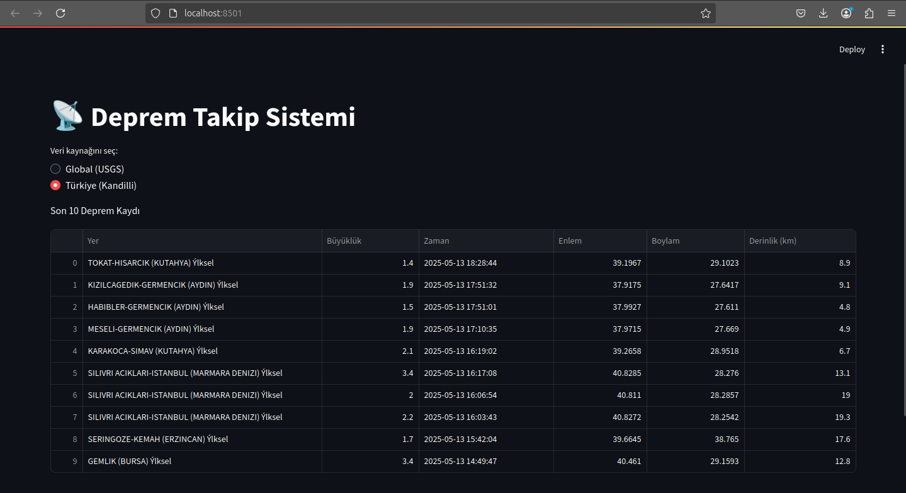
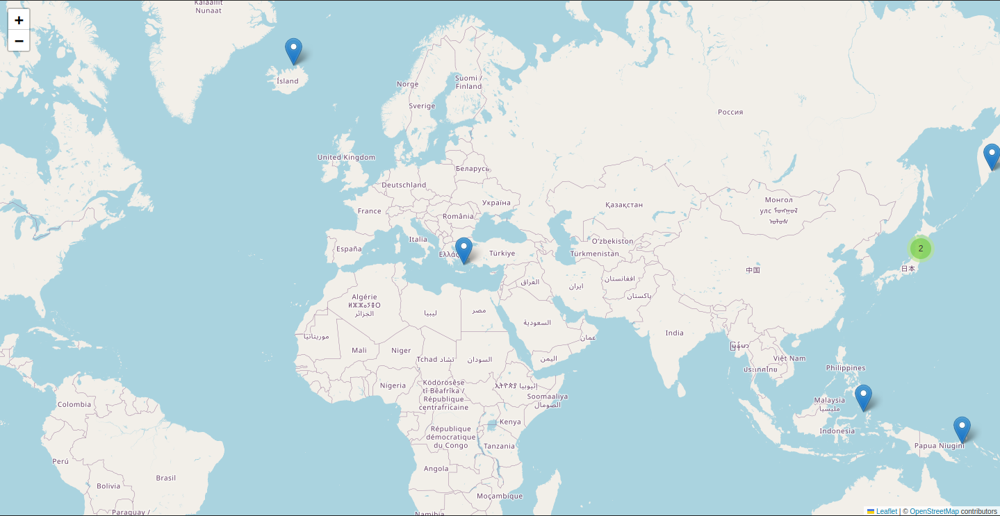

# 🌍 Deprem Takip Sistemi

**KarakasTech** tarafından geliştirilen bu açık kaynak proje, global (USGS) ve Türkiye (Kandilli Rasathanesi) merkezli depremleri **gerçek zamanlı** olarak takip etmenizi sağlar. Harita desteği, alarm sistemi ve kullanıcı dostu arayüzleriyle güvenilir ve fonksiyonel bir çözümdür.

---

## 🚀 Özellikler

- 🌐 Global Deprem Takibi (USGS API)
- 🇹🇷 Türkiye Depremleri (Kandilli Rasathanesi Web Scraper)
- 🗺️ Folium ile Harita Görselleştirme
- ⚠️ Büyüklüğe Dayalı Alarm Sistemi (6.0+)
- 🖥️ Komut Satırı Arayüzü ve Web Arayüzü (Streamlit)
- 📊 Pandas tabanlı analiz ve tablo düzeni

---

## 📁 Proje Yapısı

deprem_takip_sistemi/
├── data/ # Harita ve geçici dosyalar
├── modules/ # Ana fonksiyonel modüller
│ ├── global_tracker.py
│ ├── tr_tracker.py
│ ├── map_display.py
│ └── alert_system.py
├── ui/ # Arayüz modülleri
│ ├── cli.py
│ └── streamlit_ui.py
├── utils/ # Yardımcı araçlar
│ └── helpers.py
├── main.py # Ana uygulama dosyası
├── requirements.txt # Gerekli kütüphane listesi
└── README.md # Bu dosya 

---

## 💾 Kurulum

### 📌 Gereksinimler
- Python 3.7 veya üzeri

### ⚙️ Gerekli Kütüphaneleri Kur

### bash
pip install -r requirements.txt

## ▶️ Kullanım

### Ana Uygulama

### bash
python main.py

## Web Arayüzü (Streamlit)

## streamlit run ui/streamlit_ui.py

### 📌 Uyarı: Bu komutu çalıştırmadan önce terminalde proje klasörünün kök dizininde (main.py'nin bulunduğu yerde) olmalısınız.
📸 Ekran Görüntüleri

Web Arayüzü (Streamlit)

Harita Görselleştirmesi (Folium)

## 🔔 Alarm Sistemi

    Büyüklüğü 6.0 ve üzeri olan depremler terminalde uyarı olarak gösterilir.

    Eşik değeri modules/alert_system.py içinden değiştirilebilir.

## 📚 Lisans ve Yasal Bilgilendirme

### Bu proje MIT Lisansı ile lisanslanmıştır.

## 📌 Veri Kaynağı:

### Boğaziçi Üniversitesi Kandilli Rasathanesi ve Deprem Araştırma Enstitüsü

Sitemizde yayımlanan bilgi, veri ve haritaların telif hakları Boğaziçi Üniversitesi Rektörlüğü’ne aittir.
Kaynak gösterilerek kullanılabilir ancak ticari amaçlarla kullanılamaz.
Bu projede veriler yalnızca açık kaynak, eğitim ve bilimsel geliştirme amacıyla kullanılmıştır.
🤝 Katkı ve Destek

    Her türlü katkı, öneri ve geri bildirim memnuniyetle karşılanır.

    Pull request göndermekten çekinmeyin.

    Projeyi ⭐ yıldızlamayı ve paylaşmayı unutmayın!

## 👤 Geliştirici

### Miraç Berkay Karakaş
### 🔗 KarakasTech Resmi Web Sitesi
### 🏷️ Etiketler

### #python #deprem #earthquake #usgs #kandilli #folium #streamlit #verigörselleştirme #açık-kaynak

